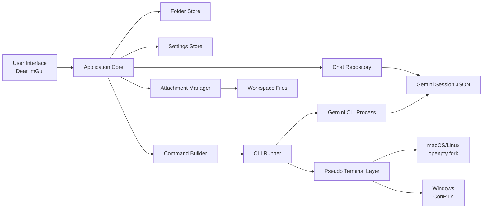

# Universal Agent Manager (Gemini CLI + Dear ImGui)


**Tags:**  
`#desktop` `#AI-agents` `#GeminiCLI` `#DearImGui` `#OpenGL` `#C++20` `#ConPTY` `#developer-tools`

---

# Universal Agent Manager

**Universal Agent Manager (UAM)** is a **high-performance desktop control surface for Gemini CLI workflows**.

It transforms raw Gemini CLI sessions into a **structured, visual workspace** where developers can:

- Browse conversation history
- Attach project files
- Replay commands
- Monitor live CLI sessions
- Manage AI workflows

UAM **does not replace Gemini CLI** — it enhances it with visibility, structure, and control.

---

# Key Features

## Session Management
- Auto-discovers Gemini sessions
- Folder-based chat organization
- Clean workspace navigation
- Persistent metadata storage

## Structured Conversation UI
- Bubble-style chat history
- Prompt editing and replay
- Command preview before execution
- File attachment tracking

## Embedded Terminal
- Fully interactive Gemini CLI terminal
- Cross-platform pseudo-terminal support
- Native terminal behaviour
- Live command execution

## Metadata Layer
- Keeps Gemini logs untouched
- Stores UI metadata separately
- Supports version control workflows
- Human-readable storage

---

# Cross Platform

| Platform | Support |
|---------|---------|
| macOS | ✅ |
| Linux | ✅ |
| Windows | ✅ (ConPTY) |

---

# Screenshots

*(Replace with real screenshots)*

| Chat View | CLI Console |
|---------|-------------|
|  |  |

---

# Executive Summary

### Purpose

Provide a **professional desktop interface for Gemini CLI sessions** that improves developer productivity and observability.

### Value

UAM eliminates the need to:

- Dig through JSON logs
- Reconstruct commands manually
- Track attached files by memory
- Re-run terminal workflows repeatedly

### Target Users

- Developers using Gemini CLI
- Engineering teams
- AI workflow builders
- On-call engineers
- Power users

---

# Architecture Overview

UAM uses a **non-invasive architecture**:

- Gemini remains the source of truth
- UAM adds metadata and UI
- CLI execution is native
- No conversation duplication

---

# Software Structure



---

# Data Layout

## Gemini Native Files

```
~/.gemini/tmp/<project>/chats/
    session1.json
    session2.json
```

These files are:

- Read directly
- Never modified (except intentional rewinds)
- Treated as source of truth

---

## UAM Metadata

```
<data-root>/

    folders.txt

    settings.txt

    chats/

        <chat-id>/
            meta.txt
```

Override location:

```
UAM_DATA_DIR=/custom/path
```

This allows:

- Per-project data
- Shared workspaces
- Version-controlled metadata

---

# Command System

Commands are generated from templates.

### Supported Placeholders

| Placeholder | Description |
|-----------|-------------|
| `{prompt}` | User prompt |
| `{files}` | Attached files |
| `{resume}` | Resume session |
| `{flags}` | Extra CLI flags |

Example:

```
gemini {resume} {flags} "{prompt}" {files}
```

---

# Terminal Architecture

UAM uses **true pseudo-terminals** for native CLI behaviour.

## macOS / Linux

```
openpty()
fork()
exec()
```

## Windows

```
CreatePseudoConsole()
ResizePseudoConsole()
```

Requires:

```
Windows 10 1809+
Server 2019+
```

---

# Operational Workflow

## 1 — Run Gemini CLI

```
gemini
```

Creates:

```
~/.gemini/tmp/<project>/chats/
```

---

## 2 — Launch UAM

```
./build/universal_agent_manager
```

Sessions appear automatically.

---

## 3 — Organize

- Create folders
- Attach files
- Configure flags
- Edit prompts

---

## 4 — Execute

Send prompt:

```
Send Button
or
Ctrl+Enter
```

UAM:

1. Builds command
2. Launches Gemini
3. Tracks output
4. Reloads session

---

# Build Instructions

## Requirements

- CMake 3.20+
- C++20 compiler
- OpenGL
- SDL2
- Gemini CLI

---

## Option A — Self Contained

```
cmake -S . -B build -DUAM_FETCH_DEPS=ON
cmake --build build -j
```

Includes:

- SDL2
- ImGui
- libvterm

---

## Option B — Custom Dependencies

```
cmake -S . -B build \
-DUAM_FETCH_DEPS=OFF \
-DIMGUI_DIR=/path/to/imgui

cmake --build build -j
```

SDL2 must be available via:

```
pkg-config
or
find_package(SDL2)
```

---

# Running

```
./build/universal_agent_manager
```

Custom data directory:

```
UAM_DATA_DIR=/tmp/uam-data ./build/universal_agent_manager
```

Windows:

```
set UAM_DATA_DIR=C:\uam-data
universal_agent_manager.exe
```

---

# Version History

| Version | Date | Highlights |
|--------|------|-----------|
| 0.1.0 | 2026-02-28 | Initial prototype |
| 0.2.0 | 2026-03-02 | Windows ConPTY support |

---

# Known Issues

## Session Detection Race

Gemini must finish writing logs before UAM detects sessions.

If missing:

- Run Gemini again
- Refresh UAM

---

## Windows Requirements

Requires:

```
Windows 10 1809+
```

Older versions lack ConPTY support.

---

## Attachment Hygiene

UAM does not copy files.

If files move:

- Paths may become invalid

---

## Interactive Edit Race

Editing prompts while Gemini is running may fail.

Solution:

- Stop terminal first

---

# Development Notes

## Fonts

Preferred:

```
Inter
```

macOS default path:

```
/Library/Fonts/
```

---

## Theme

```
ApplyModernTheme()
```

Defines UI palette.

---

## Persistence Classes

| Component | Purpose |
|----------|---------|
| ChatRepository | Chat metadata |
| ChatFolderStore | Folder mapping |
| SettingsStore | Global settings |

All stored as:

```
Plain text key-value
```

Easy to:

- Audit
- Backup
- Version control

---

# Design Philosophy

## Non-Invasive

- Gemini logs untouched
- No cloud sync
- Local-first

## Fast

- Native C++
- OpenGL rendering
- Immediate mode UI

## Transparent

- Human-readable files
- Visible commands
- No hidden automation

---

# Roadmap

Planned:

- Agent support
- Multi-project dashboards
- Session analytics
- Command history search
- Plugin architecture
- Packaging builds

---

# Evaluation Checklist

| Goal | Success Criteria |
|-----|----------------|
| Productivity | Faster prompt iteration |
| Reliability | Stable session reloads |
| Security | Local-only data |
| Support | Replay CLI sessions |

---

# Validation Steps

### 1 — Generate Sessions

Run:

```
gemini
```

Confirm:

```
~/.gemini/tmp/<project>/chats/
```

Exists.

---

### 2 — Attach File

- Attach file
- Send prompt

Verify:

- Command preview correct
- Output reloads

---

### 3 — Test Terminal

- Open CLI Console
- Run commands
- Exit Gemini

Verify:

- Terminal closes cleanly
- Status updates

---

# License

TBD

---

# Project Status

**Active Development**

Early prototype evolving toward production-ready tool.

---
