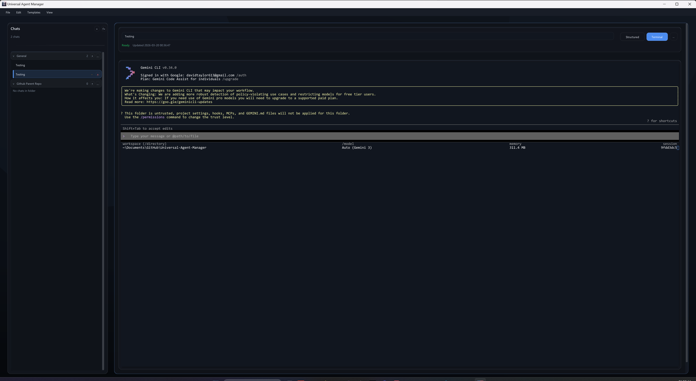

<h1>
  
  Universal Agent Manager (UAM)
</h1>

> [!WARNING]
> THIS IS VIBE CODED! I STILL NEED TO GO THROUGH CODE BY HAND AND REVIEW!!


Universal Agent Manager is a local-first desktop app for CLI-driven AI workflows.

The current default provider is Gemini CLI, and the runtime already supports provider profiles so other CLI providers can be configured without changing core app code.

## UI Screenshots

### Current: v0.0.3

#### Windows



#### macOS


<details>
<summary>Previous Releases (v0.0.1 / v0.0.2)</summary>

### v0.0.2


### v0.0.1


</details>

## Project Goals

- Local-first operation with plain-text state
- Auditable behavior with explicit command execution
- Provider-native history when an adapter is available
- No cloud backend, no telemetry, no sync service
- Reproducible workspace-driven CLI runs

## Current Scope

- Gemini is the default out-of-box provider profile.
- Provider profiles are stored in `providers.txt` and support custom command templates, interactive commands, resume flags, and message role mappings.
- Native Gemini JSON session history is supported through the `gemini-cli-json` adapter.
- Providers without a native history adapter run in local-only mode using UAM's local chat store.

## Architecture

```mermaid
flowchart TB
  subgraph APP["Boot + App Shell"]
    MAIN["main.cpp"]
    APPLICATION["Application\nInitialize/Run/RunFrame/Shutdown"]
    LEGACY["RunLegacyApplicationMain"]
    STATE["uam::AppState"]
    MAIN --> APPLICATION --> LEGACY --> STATE
  end

  subgraph PROVIDERS["Provider Runtime Polymorphism"]
    PROFILES["ProviderProfileStore\nproviders.txt"]
    RUNTIME["ProviderRuntime"]
    REGISTRY["ProviderRuntimeRegistry"]
    IPR["IProviderRuntime"]
    GSTRUCT["GeminiStructuredProviderRuntime\n(gemini-structured)"]
    GCLI["GeminiCliProviderRuntime\n(gemini-cli)"]
    CODEX["CodexCliProviderRuntime\n(codex-cli)"]
    CLAUDE["ClaudeCliProviderRuntime\n(claude-cli)"]
    OPENCODE["OpenCodeCliProviderRuntime\n(opencode-cli)"]
    OPLocal["OpenCodeLocalProviderRuntime\n(opencode-local)"]
    OLLAMA_RT["OllamaEngineProviderRuntime\n(ollama-engine)"]
    UNKNOWN["UnknownProviderRuntime\n(custom IDs)"]
    PROFILES --> RUNTIME --> REGISTRY --> IPR
    REGISTRY --> GSTRUCT
    REGISTRY --> GCLI
    REGISTRY --> CODEX
    REGISTRY --> CLAUDE
    REGISTRY --> OPENCODE
    REGISTRY --> OPLocal
    REGISTRY --> OLLAMA_RT
    REGISTRY --> UNKNOWN
  end

  subgraph HISTORY["History + Persistence"]
    LOCAL["LocalChatStore"]
    CHAT_REPO["ChatRepository"]
    GEM_HISTORY["GeminiNativeHistoryStore"]
    SETTINGS["SettingsStore\nsettings.txt"]
    FOLDERS["ChatFolderStore\nfolders.txt"]
    TEMPLATES["GeminiTemplateCatalog\nMarkdown_Templates/*.md"]
    PATHS["AppPaths / data root"]
    LOCAL --> CHAT_REPO
    GEM_HISTORY --> RUNTIME
    STATE --> SETTINGS
    STATE --> FOLDERS
    STATE --> TEMPLATES
    STATE --> PATHS
    IPR --> LOCAL
    IPR --> GEM_HISTORY
  end

  subgraph PLATFORM["Strict Platform Boundary"]
    FACTORY["PlatformServicesFactory::Instance()"]
    SERVICES["PlatformServices"]
    ITERM["IPlatformTerminalRuntime"]
    IPROC["IPlatformProcessService"]
    IFD["IPlatformFileDialogService"]
    IPATH["IPlatformPathService"]
    IUI["IPlatformUiTraits"]
    DTR["DesktopTerminalRuntime"]
    DPS["DesktopProcessService"]
    DFDS["DesktopFileDialogService"]
    DPAS["DesktopPathService"]
    DUT["DesktopUiTraits"]
    TERM_START["StartCliTerminalPlatform\n(platform/terminal_startup_dispatch.h)"]
    TERM_UNIX["terminal_unix.h"]
    TERM_WIN["terminal_windows.h"]
    FACTORY --> SERVICES
    SERVICES --> ITERM
    SERVICES --> IPROC
    SERVICES --> IFD
    SERVICES --> IPATH
    SERVICES --> IUI
    DTR --> ITERM
    DPS --> IPROC
    DFDS --> IFD
    DPAS --> IPATH
    DUT --> IUI
    TERM_START --> TERM_UNIX
    TERM_START --> TERM_WIN
  end

  subgraph ENGINE["RAG + Engine Services"]
    RAG["RagIndexService"]
    OES["OllamaEngineService\n(process-local singleton)"]
    OEC["OllamaEngineClient"]
    VCS["VcsWorkspaceService"]
    STATE --> RAG --> OES --> OEC
    VCS --> IPROC
  end

  subgraph BUILD["Build-Time Gating (CMake)"]
    TOGGLES["UAM_ENABLE_RUNTIME_*"]
    RAGFLAG["UAM_ENABLE_ENGINE_RAG"]
    TOGGLES --> RUNTIME
    TOGGLES --> OLLAMA_RT
    TOGGLES --> OPLocal
    RAGFLAG --> RAG
  end
```

```mermaid
flowchart TB
  subgraph APP_CLASSES["App + Runtime Core"]
    APPLICATION["Application"]
    APPSTATE["AppState"]
    PRUNTIME["ProviderRuntime"]
    PREGISTRY["ProviderRuntimeRegistry"]
    PPROFILES["ProviderProfileStore"]
    APPLICATION --> APPSTATE
    APPSTATE --> PRUNTIME
    PRUNTIME --> PREGISTRY
    PRUNTIME --> PPROFILES
  end

  subgraph RUNTIME_CLASSES["Provider Runtime Interface + Implementations"]
    IPR["IProviderRuntime (interface)"]
    GSTRUCT["GeminiStructuredProviderRuntime"]
    GCLI["GeminiCliProviderRuntime"]
    CODEX["CodexCliProviderRuntime"]
    CLAUDE["ClaudeCliProviderRuntime"]
    OC_CLI["OpenCodeCliProviderRuntime"]
    OC_LOCAL["OpenCodeLocalProviderRuntime"]
    OLLAMA_RT["OllamaEngineProviderRuntime"]
    UNKNOWN_RT["UnknownProviderRuntime"]
    PREGISTRY --> GSTRUCT
    PREGISTRY --> GCLI
    PREGISTRY --> CODEX
    PREGISTRY --> CLAUDE
    PREGISTRY --> OC_CLI
    PREGISTRY --> OC_LOCAL
    PREGISTRY --> OLLAMA_RT
    PREGISTRY --> UNKNOWN_RT
    GSTRUCT -. "implements" .-> IPR
    GCLI -. "implements" .-> IPR
    CODEX -. "implements" .-> IPR
    CLAUDE -. "implements" .-> IPR
    OC_CLI -. "implements" .-> IPR
    OC_LOCAL -. "implements" .-> IPR
    OLLAMA_RT -. "implements" .-> IPR
    UNKNOWN_RT -. "implements" .-> IPR
  end

  subgraph HISTORY_CLASSES["History + Persistence"]
    LOCAL["LocalChatStore"]
    GEM["GeminiNativeHistoryStore"]
    CHAT_REPO["ChatRepository"]
    SETTINGS["SettingsStore"]
    FOLDERS["ChatFolderStore"]
    TEMPLATES["GeminiTemplateCatalog"]
    PATHS["AppPaths"]
    IPR --> LOCAL
    IPR --> GEM
    LOCAL --> CHAT_REPO
    APPSTATE --> SETTINGS
    APPSTATE --> FOLDERS
    APPSTATE --> TEMPLATES
    APPSTATE --> PATHS
  end

  subgraph PLATFORM_CLASSES["Platform Services Interfaces + Adapters"]
    PSFACTORY["PlatformServicesFactory"]
    PSVC["PlatformServices"]
    ITERM["IPlatformTerminalRuntime (interface)"]
    IPROC["IPlatformProcessService (interface)"]
    IFD["IPlatformFileDialogService (interface)"]
    IPATH["IPlatformPathService (interface)"]
    IUI["IPlatformUiTraits (interface)"]
    DTR["DesktopTerminalRuntime"]
    DPS["DesktopProcessService"]
    DFD["DesktopFileDialogService"]
    DPATH["DesktopPathService"]
    DUI["DesktopUiTraits"]
    PSFACTORY --> PSVC
    PSVC --> ITERM
    PSVC --> IPROC
    PSVC --> IFD
    PSVC --> IPATH
    PSVC --> IUI
    DTR -. "implements" .-> ITERM
    DPS -. "implements" .-> IPROC
    DFD -. "implements" .-> IFD
    DPATH -. "implements" .-> IPATH
    DUI -. "implements" .-> IUI
  end

  subgraph ENGINE_CLASSES["RAG + Engine"]
    RAG["RagIndexService"]
    OES["OllamaEngineService"]
    OEC["OllamaEngineClient"]
    VCS["VcsWorkspaceService"]
    APPSTATE --> RAG
    RAG --> OES
    OES --> OEC
    VCS --> IPROC
  end
```





## How It Works

### 1) Data Root Resolution and Layout

At startup, UAM tries data roots in this order:

1. `UAM_DATA_DIR` (if set)
2. `<current-working-directory>/data`
3. OS default app-data location
4. temp fallback (`.../universal_agent_manager_data`)

Primary local layout:

```text
<data-root>/
  settings.txt
  folders.txt
  providers.txt
  frontend_actions.txt
  chats/
    <chat-id>/
      meta.txt
      messages/
        000001_user.txt
        000002_assistant.txt
```

### 2) Provider Runtime

The app merges provider profile settings with user settings, then builds either:

- A batch command for one-shot execution
- An interactive argv for terminal mode

Default Gemini template:

```text
gemini {resume} {flags} {prompt}
```

### 3) History Modes

- `gemini-cli-json`: reads Gemini native session JSON files from the project tmp mapping under `~/.gemini/tmp/.../chats`.
- `local-only`: appends responses to local chat files in `<data-root>/chats/...`.

### 4) Workspace Template Preflight

Before request execution, UAM ensures workspace `.gemini` scaffolding exists and can materialize a selected markdown template into:

```text
<workspace>/.gemini/gemini.md
```

Template catalog root defaults to:

```text
~/.Gemini_universal_agent_manager/Markdown_Templates/
```

(Overridable in app settings.)

### 5) Embedded Terminal

Interactive mode is backed by `libvterm` and launches provider CLIs in a PTY:

- macOS: `openpty`, `fork`, `execvp`
- Windows: ConPTY (`CreatePseudoConsole`) + `CreateProcessW`

## Dependencies

### Build and Runtime

- CMake 3.20+
- C++20 compiler
- OpenGL
- SDL2
- Dear ImGui
- `libvterm` (vendored under `third_party/libvterm`)

When `UAM_FETCH_DEPS=ON`, CMake fetches:

- SDL2 `release-2.30.11`
- Dear ImGui `v1.91.8`

## Build

Build directory location is enforced: all CMake build trees must live under `Builds/`.

### Self-Contained (Fetch Dependencies)

```bash
cmake -S . -B Builds -DUAM_FETCH_DEPS=ON
cmake --build Builds --config Release
```

### Custom Dependencies

```bash
cmake -S . -B Builds -DUAM_FETCH_DEPS=OFF -DIMGUI_DIR=/path/to/imgui
cmake --build Builds --config Release
```

### Tests

```bash
cmake -S . -B Builds/tests -DUAM_FETCH_DEPS=ON -DUAM_BUILD_TESTS=ON
cmake --build Builds/tests --config Debug
ctest --test-dir Builds/tests -C Debug --output-on-failure
```

### Visual Studio

For project/target layout guidance, see:

- [Visual Studio Solution Layout](docs/visual-studio-solution.md)

## Run

```bash
# macOS
./Builds/universal_agent_manager

# Windows (Visual Studio generator example)
.\Builds\Release\universal_agent_manager.exe
```

Optional data-root override:

```bash
# macOS
UAM_DATA_DIR=/tmp/uam-data ./Builds/universal_agent_manager

# Windows PowerShell
$env:UAM_DATA_DIR='C:\temp\uam-data'; .\Builds\Release\universal_agent_manager.exe
```

## Platform Notes

- macOS: supported
- Windows: requires ConPTY support (Windows 10 1809 or newer)

## Status

Active prototype.

The architecture is already modular (provider profiles + runtime adapter model), while UI workflows and defaults continue to evolve.

## License

This project is licensed under the Universal Agent Manager License (UAML) v1.0.
See [LICENSE](LICENSE) for full terms.

- Copyright remains with David Taylor (davidtaylor6130).
- Free to use and modify.
- You cannot sell the software as-is.
- If you redistribute it, include attribution: "Originally created by David Taylor (davidtaylor6130)."
