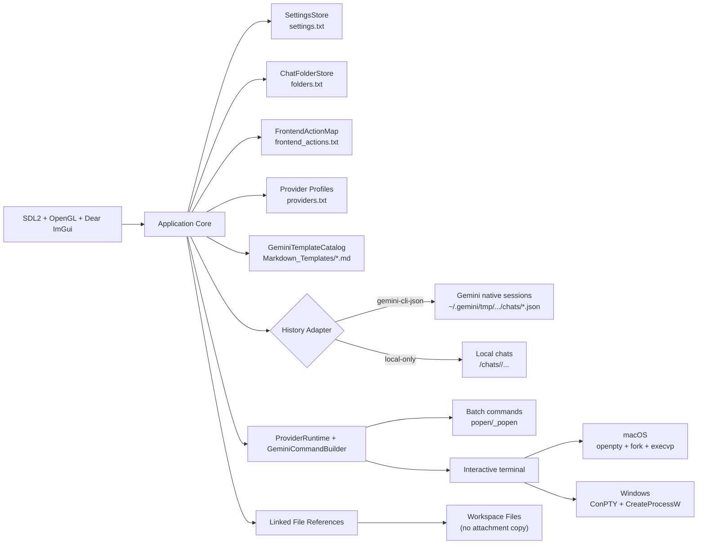

<h1>
  
  Universal Agent Manager (UAM)
</h1>

> [!WARNING]
> THIS IS VIBE CODED! I STILL NEED TO GO THROUGH CODE BY HAND AND REVIEW!!


Universal Agent Manager is a local-first desktop app for CLI-driven AI workflows.

The current default provider is Gemini CLI, and the runtime already supports provider profiles so other CLI providers can be configured without changing core app code.

## UI Screenshots

### Current: v0.0.3

#### Windows


#### macOS


<details>
<summary>Previous Releases (v0.0.1 / v0.0.2)</summary>

### v0.0.2


### v0.0.1


</details>

## Project Goals

- Local-first operation with plain-text state
- Auditable behavior with explicit command execution
- Provider-native history when an adapter is available
- No cloud backend, no telemetry, no sync service
- Reproducible workspace-driven CLI runs

## Current Scope

- Gemini is the default out-of-box provider profile.
- Provider profiles are stored in `providers.txt` and support custom command templates, interactive commands, resume flags, and message role mappings.
- Native Gemini JSON session history is supported through the `gemini-cli-json` adapter.
- Providers without a native history adapter run in local-only mode using UAM's local chat store.

## Development Roadmap

### Long Shot Goals

- Re-design the UI around Tailwind-style React components using an embedded Chromium-style GUI layer instead of Dear ImGui

### New Features / Fixes

- Get fully local basic messaging + RAG working cleanly
- Make the inspector and terminal views use the same live CLI instance
- Fix the issue where chats can spawn themselves
- Add proper model, vector DB, and vector model selection
- Get the testing suite properly in place
- Split `ollama_engine` into its own separate GitHub repository
- Improve performance
- Improve CLI instance handling so background processes are not left open doing nothing

### Done, But Still Needs Testing / Sanity Checking / Windows Port Before Main Merge

- Local LLM support via custom `ollama_engine`
- Local RAG
- Auto-testing for local LLMs
- Basic passthrough chat and model selection
- Basic RAG via deterministic hash
- Advanced RAG via GGUF model
- Improved running animation
- Fixed moving folders in the new GUI layout
- RAG model selection popup
- Refactored the monolithic structure into much cleaner project and file layouts
- Started automatic model testing
- Started a model wizard to help min-max performance
- Included standard benchmark tests for LLM model wizard / model comparisons
- Added model token context window passthrough
- Fixed the UI to run at 30 FPS
- Added a custom file format to store optimised model and hardware data so known hardware does not need to be benchmarked again

## Architecture



## How It Works

### 1) Data Root Resolution and Layout

At startup, UAM uses a strict portable data root:

1. `<exe-folder>/data` on Windows/Linux
2. `<YourApp>.app/data` on macOS bundles (bundle root, not `Contents/MacOS`)

No user-profile, temp, or CWD fallback paths are used.

Primary local layout:

```text
<data-root>/
  settings.txt
  folders.txt
  providers.txt
  frontend_actions.txt
  chats/
    <chat-id>/
      meta.txt
      messages/
        000001_user.txt
        000002_assistant.txt
```

### 2) Provider Runtime

The app merges provider profile settings with user settings, then builds either:

- A batch command for one-shot execution
- An interactive argv for terminal mode

Default Gemini template:

```text
gemini {resume} {flags} {prompt}
```

### 3) History Modes

- `gemini-cli-json`: reads Gemini native session JSON files from the project tmp mapping under `~/.gemini/tmp/.../chats`.
- `local-only`: appends responses to local chat files in `<data-root>/chats/...`.
- Optional in-app mirror: when enabled in Settings, Gemini native chats are copied into `<data-root>/chats/...` at startup, on idle intervals, and on shutdown.

### 4) Workspace Template Preflight

Before request execution, UAM ensures workspace `.gemini` scaffolding exists and can materialize a selected markdown template into:

```text
<workspace>/.gemini/gemini.md
```

Template catalog root defaults to:

```text
~/.Gemini_universal_agent_manager/Markdown_Templates/
```

(Overridable in app settings.)

### 5) Embedded Terminal

Interactive mode is backed by `libvterm` and launches provider CLIs in a PTY:

- macOS: `openpty`, `fork`, `execvp`
- Windows: ConPTY (`CreatePseudoConsole`) + `CreateProcessW`

## Dependencies

### Build and Runtime

- CMake 3.20+
- C++20 compiler
- OpenGL
- SDL2
- Dear ImGui
- `libvterm` (vendored under `third_party/libvterm`)

When `UAM_FETCH_DEPS=ON`, CMake fetches:

- SDL2 `release-2.30.11`
- Dear ImGui `v1.91.8`

## Build

### Self-Contained (Fetch Dependencies)

```bash
cmake -S . -B build -DUAM_FETCH_DEPS=ON
cmake --build build --config Release
```

### Custom Dependencies

```bash
cmake -S . -B build -DUAM_FETCH_DEPS=OFF -DIMGUI_DIR=/path/to/imgui
cmake --build build --config Release
```

### Tests

```bash
cmake -S . -B build-tests -DUAM_FETCH_DEPS=ON -DUAM_BUILD_TESTS=ON
cmake --build build-tests --config Debug
ctest --test-dir build-tests -C Debug --output-on-failure
```

### Visual Studio

For project/target layout guidance, see:

- [Visual Studio Solution Layout](docs/visual-studio-solution.md)

## Run

```bash
# macOS
./build/universal_agent_manager

# Windows (Visual Studio generator example)
.\build\Release\universal_agent_manager.exe
```

Optional data-root override:

```bash
# macOS
UAM_DATA_DIR=/tmp/uam-data ./build/universal_agent_manager

# Windows PowerShell
$env:UAM_DATA_DIR='C:\temp\uam-data'; .\build\Release\universal_agent_manager.exe
```

## Platform Notes

- macOS: supported
- Windows: requires ConPTY support (Windows 10 1809 or newer)

## Status

Active prototype.

The architecture is already modular (provider profiles + runtime adapter model), while UI workflows and defaults continue to evolve.

## License

This project is licensed under the Universal Agent Manager License (UAML) v1.0.
See [LICENSE](LICENSE) for full terms.

- Copyright remains with David Taylor (davidtaylor6130).
- Free to use and modify.
- You cannot sell the software as-is.
- If you redistribute it, include attribution: "Originally created by David Taylor (davidtaylor6130)."
