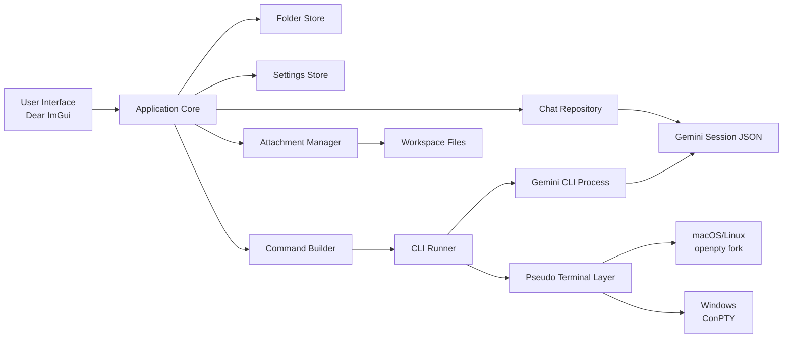

# Universal Agent Manager (Gemini CLI + Dear ImGui)


Universal Agent Manager (UAM) is a **local-first desktop interface for Gemini CLI workflows**.

It began as a personal fix: Gemini CLI never offered an easy way to edit past prompts or keep session history quietly in the background, so I wrapped it with UAM to track history, attachments, and folder structure without fighting the native log files.

It provides a structured UI for managing Gemini sessions while **keeping Gemini CLI as the source of truth**.

UAM is designed to be **transparent, auditable, and non-invasive**, making it suitable for development environments with strict security requirements.

---

# Key Properties

- **Local-first**
- **No cloud services**
- **No telemetry**
- **No network calls**
- **Gemini logs remain source-of-truth**
- **Human-readable metadata**
- **Deterministic CLI execution**

---

# Current Architecture


in the future would love to add a layer to support multiple Gemini CLI software like Open AI codex. But right now its Gemini Only.

---

# How It Works

### 1 — Gemini CLI Creates Sessions

Gemini writes session logs:

```
~/.gemini/tmp/<project_hash>/chats/*.json
```

These files remain the **source of truth**.

UAM reads these files directly.

---

### 2 — UAM Adds Metadata

UAM stores UI-only metadata:

```
<data-root>/

folders.txt
settings.txt

chats/
  <chat-id>/
    meta.txt
```

Location override:

```
UAM_DATA_DIR=/custom/path
```

Metadata contains:

- Folder organization
- File attachments
- Command templates
- UI settings

Gemini logs are **not duplicated**.

---

### 3 — Command Execution

Commands are generated from templates:

```
gemini {resume} {flags} {prompt}
```

Commands run as native processes.

No background agents.

No hidden execution.

---

### 4 — Embedded Terminal

UAM runs Gemini inside a pseudo terminal.

macOS/Linux:

```
openpty()
fork()
exec()
```

Windows:

```
CreatePseudoConsole()
```

Terminal behavior matches native shells.

---

# Dependencies

## Required

| Dependency | Purpose |
|----------|---------|
| Gemini CLI | AI execution |
| CMake 3.20+ | Build system |
| C++20 Compiler | Core language |
| OpenGL | Rendering |
| SDL2 | Windowing |

---

## Bundled (Optional FetchContent)

| Dependency | Purpose |
|-----------|---------|
| Dear ImGui | UI framework |
| libvterm | Terminal emulation |

---

# Security Model

## Data Storage

All data is stored locally:

Gemini:

```
~/.gemini/
```

UAM:

```
<data-root>/
```

No remote storage.

No sync.

No upload.

---

## Network Activity

UAM performs:

- **Zero outbound network calls**
- **Zero inbound network listeners**

Only Gemini CLI may perform network requests.

---

## File Access

UAM accesses:

- Gemini session JSON files
- User-selected attachment files
- UAM metadata files

UAM does **not copy attachments**.

Paths are referenced directly.

---

## Process Execution

UAM launches only:

```
gemini
```

Execution is visible in:

- Command preview
- CLI terminal

No hidden subprocesses.

---

# Build

## Self-Contained

```
cmake -S . -B build -DUAM_FETCH_DEPS=ON
cmake --build build -j
```

---

## Custom Dependencies

```
cmake -S . -B build \
-DUAM_FETCH_DEPS=OFF \
-DIMGUI_DIR=/path/to/imgui
```

---

# Run

```
./build/universal_agent_manager
```

Optional data root:

```
UAM_DATA_DIR=/tmp/uam-data ./build/universal_agent_manager
```

---

# Security Review Notes

This project is intended to be easy to audit.

Properties:

- Plain-text metadata
- No binary databases
- No background services
- No auto-updaters
- No plugins
- No scripting engine
- No dynamic code loading

Gemini CLI remains the only AI runtime.

---

# Platform Requirements

| Platform | Requirement |
|---------|-------------|
| macOS | Supported |
| Linux | Supported |
| Windows | Windows 10 1809+ |

Windows requires ConPTY support.

---

# Project Status

**Early Development Prototype**

Architecture is stable.
Features are evolving.

---

```
