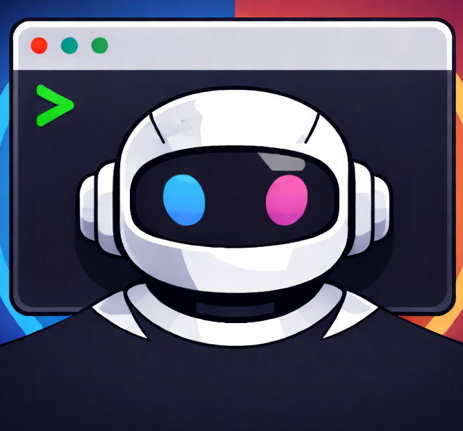
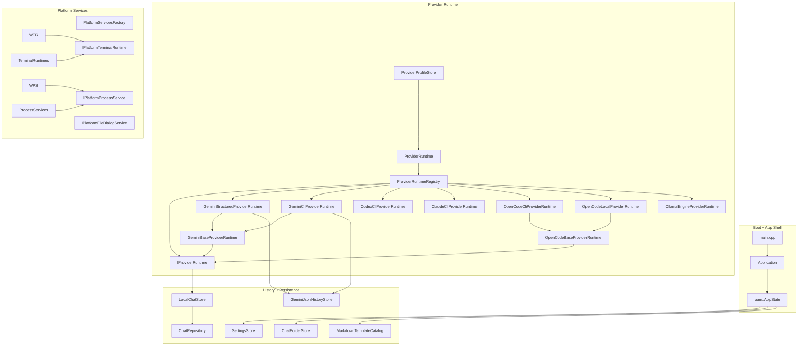

<h1>
  
  Universal Agent Manager (UAM)
</h1>

A local-first desktop application for managing CLI-driven AI agent workflows across multiple providers.

[](https://github.com/davidtaylor6130/Universal-Agent-Manager)
[](https://github.com/davidtaylor6130/Universal-Agent-Manager)
[](https://github.com/ocornut/imgui)
[](LICENSE)

## Support Matrix

### Provider Feature Support

| Provider | ID | Output Mode | Structured View | CLI Console View | Interactive Mode | Native History | Local History | Session Resume | Path Bootstrap |
|----------|:--:|:-----------:|:---------------:|:----------------:|:----------------:|:-------------:|:-------------:|:--------------:|:--------------:|
| **Gemini Structured** | `gemini-structured` | Structured | ✅ | ❌ | ✅ | ✅ | ❌ | ✅ | ✅ |
| **Gemini CLI** | `gemini-cli` | CLI | ❌ | ✅ | ✅ | ✅ | ❌ | ✅ | ✅ |
| **Codex CLI** | `codex-cli` | CLI | ❌ | ✅ | ✅ | ❌ | ✅ | ✅ | ❌ |
| **Claude CLI** | `claude-cli` | CLI | ❌ | ✅ | ✅ | ❌ | ✅ | ✅ | ❌ |
| **OpenCode CLI** | `opencode-cli` | CLI | ❌ | ✅ | ✅ | ❌ | ✅ | ✅ | ❌ |
| **OpenCode Local** | `opencode-local` | CLI (Engine) | ❌ | ✅ | ❌ | ❌ | ✅ | ✅ | ❌ |
| **Ollama Engine** | `ollama-engine` | Structured | ✅ | ❌ | ❌ | ❌ | ✅ | ❌ | ❌ |

### Table Legend

| Symbol | Meaning |
|--------|---------|
| ✅ | Supported |
| ❌ | Not Supported |
| **Structured** | Provider uses structured (JSON/API) output mode |
| **CLI** | Provider uses CLI terminal output mode |
| **CLI (Engine)** | Provider uses local engine (no external CLI required) |

### View Descriptions

| View | Description |
|------|-------------|
| **Structured View** | Chat bubble interface with message history, tool calls, and inline responses |
| **CLI Console View** | Embedded terminal (libvterm/ConPTY) running the provider's CLI directly |

### Interactive Mode

**Interactive Mode** allows providers to launch a full terminal session within the embedded console, enabling:
- Multi-turn conversations with persistent state
- Real-time CLI output streaming
- Interactive prompts (e.g., confirmation dialogs, file selection)
- Provider-controlled terminal features (colors, cursor movement)

When Interactive Mode is disabled for a provider, UAM executes single-shot batch commands only.

### History Mode Definitions

| Mode | Description |
|------|-------------|
| **Native History** | Reads from provider's native session files (Gemini JSON format in `~/.gemini/tmp/`) with local overlay |
| **Local History** | UAM-managed chat storage in `<data-root>/chats/` |

## Quick Start

```bash
# Build with dependencies
cmake -S . -B Builds -DUAM_FETCH_DEPS=ON
cmake --build Builds --config Release

# Run
./Builds/universal_agent_manager
```

## Key Features

- **Multi-Provider Support** — Seamlessly switch between Gemini, Codex, Claude, OpenCode, and Ollama
- **Flexible Views** — Structured chat UI or embedded terminal for each provider
- **Local-First Storage** — Plain-text state with no cloud dependencies
- **Provider Profiles** — Configure providers via `providers.txt` without modifying code
- **Workspace Templates** — Materialize markdown templates into workspace `.gemini` directories
- **RAG Support** — Optional retrieval-augmented generation via Ollama engine

## Project Goals

- Local-first operation with plain-text state
- Auditable behavior with explicit command execution
- Provider-native history when an adapter is available
- No cloud backend, no telemetry, no sync service
- Reproducible workspace-driven CLI runs

## Architecture

### Diagram Legend

```text
┌─────────────────┐     ┌─────────────────┐     ┌─────────────────┐
│   Subgraph      │ ──▶ │   Component     │ ──▶ │   Component     │
│   (Module)      │     │   (Class/File)  │     │   (Class/File)  │
└─────────────────┘     └─────────────────┘     └─────────────────┘
```



## Data Layout

```
<data-root>/
├── settings.txt
├── folders.txt
├── providers.txt
└── chats/
    └── <chat-id>/
        ├── meta.txt
        └── messages/
            ├── 000001_user.txt
            └── 000002_assistant.txt
```

### Data Root Resolution

1. `UAM_DATA_DIR` environment variable (if set)
2. `<current-working-directory>/data`
3. OS default app-data location
4. Temp fallback

## Dependencies

- CMake 3.20+
- C++20 compiler
- OpenGL
- SDL2
- Dear ImGui
- libvterm (vendored)
- libcurl

## Build

```bash
# Self-contained (fetches dependencies)
cmake -S . -B Builds -DUAM_FETCH_DEPS=ON
cmake --build Builds --config Release

# Custom dependencies
cmake -S . -B Builds -DUAM_FETCH_DEPS=OFF -DIMGUI_DIR=/path/to/imgui
cmake --build Builds --config Release
```

### Runtime Options

| Option | Default | Description |
|--------|---------|-------------|
| `UAM_FETCH_DEPS` | ON | Fetch SDL2 and Dear ImGui |
| `UAM_FETCH_LLAMA_CPP` | ON | Fetch pinned llama.cpp fork |
| `UAM_BUILD_TESTS` | OFF | Build test executable |

## ⚠️ Critical: Provider Disable Flags

**If you do not want UAM to be able to call or use a specific provider, you MUST disable it at build time.** Disabled providers are completely excluded from the binary and cannot be invoked.

### Disable All External Provider Calls

To build UAM with **no external CLI providers** (only Ollama Engine):

```bash
cmake -S . -B Builds -DUAM_FETCH_DEPS=ON \
  -DUAM_ENABLE_RUNTIME_GEMINI_STRUCTURED=OFF \
  -DUAM_ENABLE_RUNTIME_GEMINI_CLI=OFF \
  -DUAM_ENABLE_RUNTIME_CODEX_CLI=OFF \
  -DUAM_ENABLE_RUNTIME_CLAUDE_CLI=OFF \
  -DUAM_ENABLE_RUNTIME_OPENCODE_CLI=OFF \
  -DUAM_ENABLE_RUNTIME_OPENCODE_LOCAL=OFF
cmake --build Builds --config Release
```

### Disable Individual Providers

| Provider | ID | CMake Flag |
|----------|----|------------|
| Gemini Structured | `gemini-structured` | `-DUAM_ENABLE_RUNTIME_GEMINI_STRUCTURED=OFF` |
| Gemini CLI | `gemini-cli` | `-DUAM_ENABLE_RUNTIME_GEMINI_CLI=OFF` |
| Codex CLI | `codex-cli` | `-DUAM_ENABLE_RUNTIME_CODEX_CLI=OFF` |
| Claude CLI | `claude-cli` | `-DUAM_ENABLE_RUNTIME_CLAUDE_CLI=OFF` |
| OpenCode CLI | `opencode-cli` | `-DUAM_ENABLE_RUNTIME_OPENCODE_CLI=OFF` |
| OpenCode Local | `opencode-local` | `-DUAM_ENABLE_RUNTIME_OPENCODE_LOCAL=OFF` |
| Ollama Engine | `ollama-engine` | `-DUAM_ENABLE_RUNTIME_OLLAMA_ENGINE=OFF` |

> **Note:** `opencode-local` requires both `opencode-cli` and `ollama-engine` to be enabled.

### Tests

```bash
cmake -S . -B Builds/tests -DUAM_FETCH_DEPS=ON -DUAM_BUILD_TESTS=ON
cmake --build Builds/tests --config Debug
ctest --test-dir Builds/tests -C Debug --output-on-failure
```

## Run

```bash
# macOS
./Builds/universal_agent_manager

# Windows
.\Builds\Release\universal_agent_manager.exe

# Custom data root
UAM_DATA_DIR=/tmp/uam-data ./Builds/universal_agent_manager
```

## Platform Notes

| Platform | Minimum Version | Terminal |
|----------|-----------------|----------|
| macOS | Current | openpty/fork/execvp |
| Windows | Windows 10 1809+ | ConPTY/CreatePseudoConsole |

## License

This project is licensed under the Universal Agent Manager License (UAML) v1.0.
See [LICENSE](LICENSE) for full terms.

- Copyright remains with David Taylor (davidtaylor6130)
- Free to use and modify
- Cannot be sold as-is
- Redistribution requires attribution
