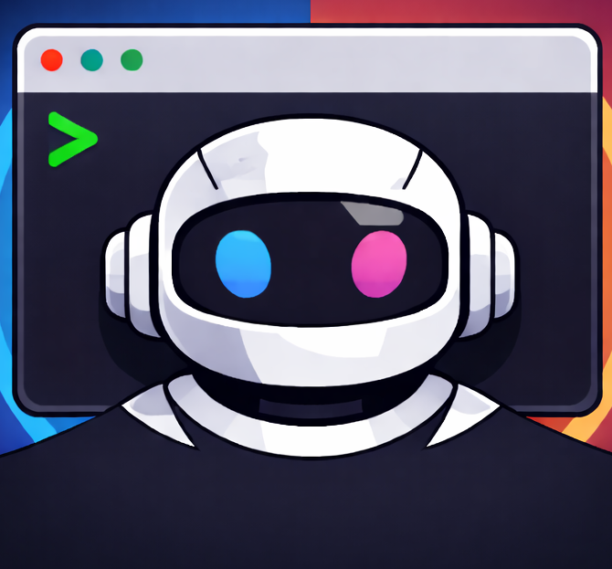
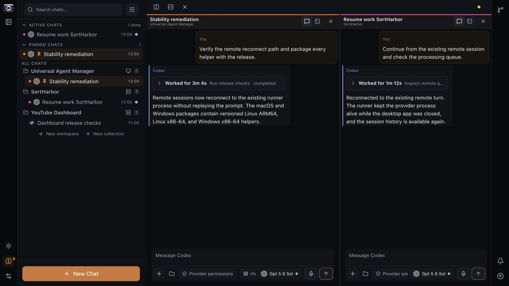
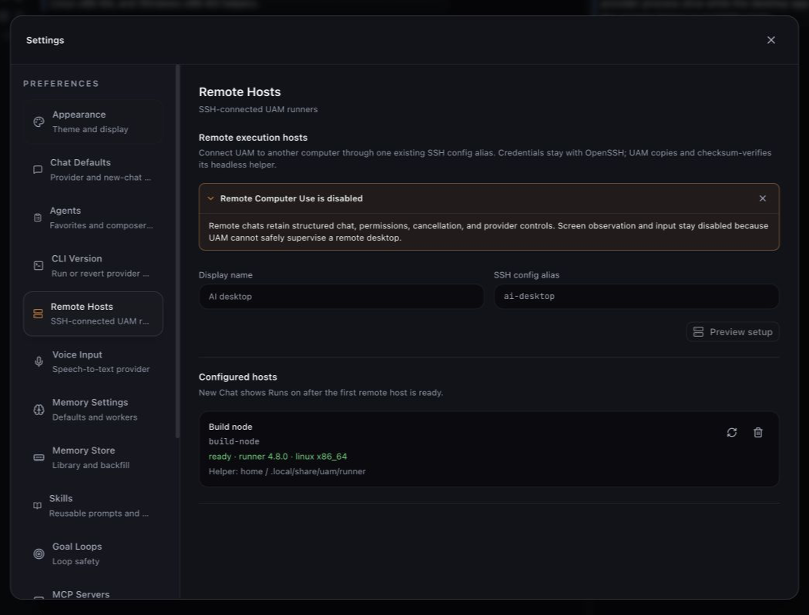

<h1>
  
  Universal Agent Manager
</h1>

Run Gemini CLI, Codex CLI, Claude Code CLI, OpenCode CLI, and GitHub Copilot CLI from one local desktop app. UAM provides structured chat, embedded terminals, persistent history, flexible multi-pane layouts, and SSH execution on remote machines.

[](https://github.com/davidtaylor6130/Universal-Agent-Manager/actions/workflows/ci.yml)
[](https://github.com/davidtaylor6130/Universal-Agent-Manager/releases)
[](#platform-support)
[](LICENSE)

UAM is local-first, not offline-only. The app stores its own settings and history as local files and has no cloud backend, sync service, or telemetry. Provider CLIs still send prompts and permitted workspace data according to their own configuration and service terms.

## Quick start

1. Download the correct archive from [GitHub Releases](https://github.com/davidtaylor6130/Universal-Agent-Manager/releases):
   - `UAM-macOS-ARM.zip` for Apple Silicon
   - `UAM-macOS-Intel.zip` for Intel Macs
   - `UAM-Windows.zip` for Windows x64
2. Install and sign in to at least one supported provider CLI.
3. Launch UAM and create a workspace.
4. Choose a provider, model, and permission mode for the chat.

The current macOS packages are ad hoc signed rather than notarized. Windows packages are unsigned ZIP archives. See [security and enterprise deployment](docs/security-enterprise.md) before distributing UAM in a managed environment.

## Current interface



The workspace view can hold up to nine chats. Each pane keeps its own selected chat and structured or terminal view, while the sidebar reports active, completed, pinned, local, and remote sessions.



Remote hosts use existing OpenSSH aliases. UAM installs a versioned helper in the remote user's home directory and verifies its checksum, version, and protocol before use.

## What UAM does

- Runs five built-in CLI providers without removing their native command-line workflows.
- Gives every provider a structured chat view and an embedded xterm.js terminal fallback.
- Stores normalized chat history locally, with native provider resume when the provider exposes a reusable session ID.
- Opens up to nine chats in a recursive split layout with horizontal and vertical splits, resizing, per-pane state, and persisted layout.
- Runs chats on the local computer or a configured SSH host.
- Keeps remote provider jobs alive when the desktop app closes, then reconnects without replaying the delivered prompt.
- Supports chat create, rename, delete, pin, branch, search, provider switching, and portable read-only chat bundles.
- Shows tool calls, plans, approvals, user-input requests, attachments, expandable sub-agent history, and background activity in the transcript.
- Adds UAM agents, delegated agent runs, durable goals, bounded auto-resume, loop detection, and stall reporting.
- Supports Git worktree isolation, commits, discard, rollback, and port-to-source workflows.
- Stores durable global or workspace memory and provides manual scans, background extraction, and a searchable memory library.
- Connects workspace-scoped MCP servers and offers a packaged local Computer Use MCP companion.
- Provides configurable editor, Finder, Explorer, and shell actions without storing provider credentials.

### Provider handoff

The normalized transcript stays visible when a chat changes provider. UAM also preserves its own title, workspace, goals, agent selection, and recorded tool results. A provider change starts a new native session with the destination provider's defaults. It does not transplant the previous provider's private thread state or silently replay the full transcript.

Portable chat imports are passive, read-only transcripts. Reconnect workspaces, provider sessions, agents, goals, attachments, and permissions explicitly before running them.

## Provider support

| Provider | Structured transport | Embedded terminal | Native resume |
|---|---|---|---|
| Gemini CLI | ACP | Yes | Yes |
| Codex CLI | app-server over stdio | Yes | Yes |
| Claude Code CLI | stream JSON | Yes | When the CLI exposes a session ID |
| OpenCode CLI | ACP | Yes | When ACP exposes a session ID |
| GitHub Copilot CLI | ACP | Yes | When ACP exposes a session ID |

Structured sessions surface the provider features available through that transport. Terminal fallback remains an opaque provider-controlled PTY, so UAM cannot mediate its internal tool approvals.

The release-gating capability matrix is in [provider runtime parity](docs/provider-runtime-parity.md).

## Permission modes

Structured chats expose four command-safety choices:

| Mode | Behavior |
|---|---|
| Default / Ask | Leaves approval decisions to the user or provider flow. |
| Accept Edits | Allows supported edit operations while retaining broader approval boundaries. |
| AI Review | Sends bounded approval decisions through the configured reviewer. |
| YOLO | Uses the provider's least restrictive supported mode. Use it only in a disposable or trusted workspace. |

Plan mode is separate. It is a hard read-only ceiling even when another permission setting is selected.

## Remote execution

UAM uses aliases already defined in `~/.ssh/config`. Authentication stays with OpenSSH, including keys, agents, host checks, and any user-configured proxy or jump-host rules. UAM does not copy SSH credentials into its settings.

The packaged remote helper supports:

| Remote target | Architecture |
|---|---|
| Linux | x86-64 and ARM64 |
| Windows | x86-64 |

The macOS and Windows desktop packages include all three helper targets plus checksum and version metadata. Helper activation is versioned and rollback-aware. The local UAM controller remains the canonical owner of chat metadata, settings, and normalized history.

Remote structured sessions retain provider controls, approvals, cancellation, history refresh, and reconnect recovery. Embedded terminal sessions can also run through the remote helper.

Current remote boundaries:

- Computer Use is local-only because UAM cannot supervise a remote desktop safely.
- Remote workspace editor and file-manager actions are disabled.
- A remote chat cannot be moved to a different workspace directory.
- macOS is not currently packaged as a remote helper target.

## Computer Use and MCP

Local structured chats can use the packaged UAM Computer Use companion through MCP. The provider receives bounded screenshots and accessibility labels, then requests actions through the companion. UAM requires an OS-native allow or deny decision before returning observations.

macOS requires Screen Recording and Accessibility permission. Windows uses UI Automation and requires an interactive foreground desktop. Secure desktops, UAC prompts, elevated windows, and remote chats are outside the supported boundary.

Workspaces can also define local stdio, HTTP, or SSE MCP servers. Secret values remain environment references rather than being copied into the workspace configuration.

Read [Computer Use architecture and safety](docs/computer-use.md) before enabling it for sensitive work.

## Local data and privacy

UAM resolves its data root in this order:

1. `UAM_DATA_DIR`, when explicitly set.
2. The operating-system app-data location:
   - macOS: `~/Library/Application Support/Universal Agent Manager`
   - Windows: `%LOCALAPPDATA%\Universal Agent Manager`, with `%APPDATA%` and the user profile as fallbacks
3. A temporary directory when no usable home or app-data location exists.
4. A relative `data` directory only when no temporary directory can be resolved.

The main layout is:

```text
<data-root>/
  settings.txt
  folders.txt
  chats/
    <chat-id>.json
    <chat-id>.json.bak
  chat-summaries/
  memory/
  themes/
  agents/
  agent-runs/
  computer-use/
```

Workspace-scoped memories are stored under `<workspace>/.UAM/`. Staged attachments use `<workspace>/.UAM/attachments/<chat-id>/`.

Set a disposable data root when testing a build without touching your normal UAM history:

```bash
UAM_DATA_DIR=/tmp/uam-test-data \
  ./Builds/universal_agent_manager.app/Contents/MacOS/universal_agent_manager
```

## Platform support

| Component | Supported platforms |
|---|---|
| Desktop app | macOS 10.15 or newer, Apple Silicon and Intel; Windows 10 1809 or newer, x64 |
| Local terminal | `openpty` on macOS; ConPTY on Windows |
| Remote helper | Linux x86-64, Linux ARM64, Windows x86-64 |

There is no Linux desktop GUI build. RAG engines, local model engines, templates, Dear ImGui, and checked-in frontend build output are outside the current release scope.

## Build from source

Requirements:

- CMake 3.20 or newer
- A C++20 compiler
- Node.js 20 and npm
- Internet access during the first configure so CMake can fetch CEF and `nlohmann/json`
- Xcode command-line tools on macOS, or MSVC Build Tools on Windows
- The provider CLIs you intend to run: `gemini`, `codex`, `claude`, `opencode`, or `copilot`

CMake requires build directories inside `Builds/`. CLion's default `cmake-build-*` directories are also accepted.

### Frontend

```bash
npm --prefix UI-V2 ci
npm --prefix UI-V2 run test
npm --prefix UI-V2 run build
```

Do not open `UI-V2/dist/index.html` directly. The frontend expects the native CEF bridge.

### Local development build

Disable remote-helper packaging when you only need a local development build:

```bash
npm --prefix UI-V2 ci
cmake -S . -B Builds/dev \
  -DUAM_BUILD_TESTS=OFF \
  -DUAM_PACKAGE_REMOTE_RUNNERS=OFF
cmake --build Builds/dev --config Release --parallel 4
```

On Windows, initialize MSVC before running the same commands:

```bat
call "C:\Program Files (x86)\Microsoft Visual Studio\18\BuildTools\VC\Auxiliary\Build\vcvars64.bat"
npm --prefix UI-V2 ci
cmake -S . -B Builds\dev -A x64 -DUAM_BUILD_TESTS=OFF -DUAM_PACKAGE_REMOTE_RUNNERS=OFF
cmake --build Builds\dev --config Release --parallel 4
```

### Complete macOS package

`build.sh` builds the desktop app and cross-builds every remote helper. It requires [Zig](https://ziglang.org/) plus MinGW-w64:

```bash
brew install zig mingw-w64
./build.sh
```

The interactive script lets you exclude provider runtimes, but at least one provider must remain enabled.

### Release-compatible direct build

Full app packaging fails closed unless these helper artifacts, checksums, and version files exist:

```text
Builds/remote-artifacts/
  linux-arm64/
  linux-x86_64/
  windows-x86_64/
```

After populating that directory, build with:

```bash
npm --prefix UI-V2 ci
cmake -S . -B Builds \
  -DUAM_REMOTE_RUNNER_ARTIFACT_DIR="$PWD/Builds/remote-artifacts"
cmake --build Builds --config Release --parallel 4
```

The GitHub release workflow builds these helpers independently, verifies their reported version, and injects all three into each desktop package.

## Tests and release gates

Run the local test suite without requiring packaged remote helpers:

```bash
npm --prefix UI-V2 ci
npm --prefix UI-V2 run test
npm --prefix UI-V2 run build

cmake -S . -B Builds/tests \
  -DUAM_BUILD_TESTS=ON \
  -DUAM_PACKAGE_REMOTE_RUNNERS=OFF
cmake --build Builds/tests --config Debug --parallel 4
ctest --test-dir Builds/tests -C Debug --output-on-failure
```

Pull-request CI also runs:

- A locked CycloneDX frontend SBOM check.
- Frontend tests and the production frontend build.
- Linux x86-64, Linux ARM64, and Windows x86-64 helper builds with version smoke tests.
- Native Release builds and CTest on macOS ARM, macOS Intel, and Windows x64.
- Packaged-app smoke tests that validate the bundled UI, CEF resources, helper checksums, launch, and shutdown.
- Separate Computer Use and provider CLI contract checks.

Release tags must match the version in `UI-V2/package.json`. The release workflow publishes the two macOS archives, the Windows archive, and the frontend SBOM.

## Architecture

```text
UI-V2/src/                         React, Zustand, Tailwind CSS, xterm.js
src/cef/                           CEF query bridge and pushed state updates
src/app/                           application services, goals, agents, memory, VCS
src/common/provider/               five provider implementations and runtime registry
src/common/runtime/acp/            structured-session orchestration
src/common/runtime/terminal/       terminal fallback orchestration
src/remote/                        SSH bridge, helper installer, runner protocol and service
src/computer_use/                  packaged local Computer Use companion
src/common/chat/                   normalized chat persistence and recovery
```

The app starts at `src/main.cpp`, creates the native application in `src/app/application.cpp`, and hosts the React build inside CEF. The UI calls native services through `window.cefQuery`; native state changes return through `window.uamPush`.

Useful design documents:

- [Provider runtime parity](docs/provider-runtime-parity.md)
- [Computer Use architecture and safety](docs/computer-use.md)
- [Security and enterprise deployment](docs/security-enterprise.md)
- [Visual Studio solution guide](docs/visual-studio-solution.md)

## Known limitations

Tracked release gaps remain in [GitHub Issues](https://github.com/davidtaylor6130/Universal-Agent-Manager/issues). The current remote-helper limitations are:

- Clean local Windows app builds do not yet acquire the Linux helper artifacts automatically ([#350](https://github.com/davidtaylor6130/Universal-Agent-Manager/issues/350)).
- Helper installation is serialized within one UAM process, but separate UAM processes can update the same host concurrently ([#351](https://github.com/davidtaylor6130/Universal-Agent-Manager/issues/351)).
- Slow remote rollback or cleanup can briefly delay the settings completion path ([#352](https://github.com/davidtaylor6130/Universal-Agent-Manager/issues/352)).
- Remaining remote workspace parity gaps are tracked in [#353](https://github.com/davidtaylor6130/Universal-Agent-Manager/issues/353).

## License

Universal Agent Manager is available under the [MIT License](LICENSE).
