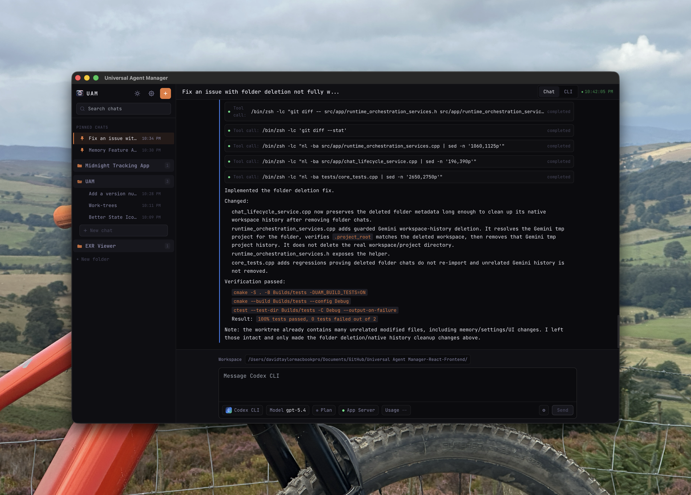
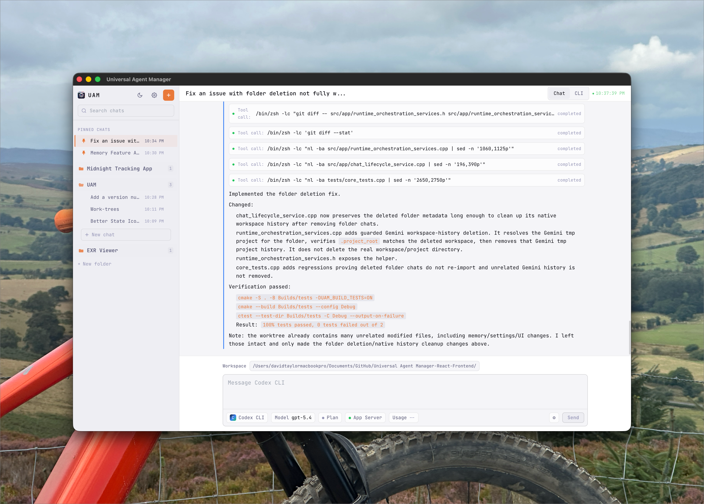

<h1>
  
  Universal Agent Manager (UAM)
</h1>

**A local-first macOS and Windows desktop app for running CLI-driven AI agents across multiple providers from one interface.**

Universal Agent Manager runs a React/Vite UI inside CEF (Chromium Embedded Framework) and connects it to agent CLIs through C++ runtime services. It is focused on local, CLI-backed agent sessions with no cloud backend, telemetry, or sync service.

[](https://github.com/davidtaylor6130/Universal-Agent-Manager)
[](https://github.com/davidtaylor6130/Universal-Agent-Manager)
[](https://github.com/davidtaylor6130/Universal-Agent-Manager)
[](LICENSE)

## Screenshots

Dark theme:



Light theme:



## Key Features

- **Multi-provider** — Built-in CLI providers for Gemini, Codex, Claude Code, OpenCode, and GitHub Copilot, switchable per chat.
- **Two session paths per provider** — A structured chat path over each provider's protocol, and an xterm.js terminal fallback for the raw interactive CLI.
- **Universal chat history** — Chats are stored in UAM's own normalized format, so you can start with one provider and continue with another.
- **Local-first storage** — Chat metadata, settings, folders, theme, window/sidebar state, markdown store, and durable memory are all stored locally as files. No cloud, no telemetry.
- **Git worktree isolation** — Optional per-chat git worktree create, status, diff, commit, discard, and port workflows.
- **Workspace folders** — One-level workspace folders drive provider working directories and Gemini history discovery, with collapsible collections for grouping related workspaces.
- **Command safety** — Low, medium, and high safety tiers gate risky commands, with permission modes available from the composer `+` menu and slash commands.
- **Finder and Explorer actions** — Configurable per-user shell actions open selected files and folders as workspaces or run Markdown Store skills.
- **Durable memory** — Idle extraction and manual scans write durable memory files, with workspace-local memories under `<workspace>/.codex/memories/`. Memory library supports browsing, scanning, and categorizing lessons and failures.
- **Goal system** — Plan-driven multi-step goals with auto-resume, loop detection, and stall watchdog.
- **Concurrent sessions** — Multiple CLI and structured runtime sessions run side by side on macOS and Windows.

Removed or intentionally unsupported surfaces include RAG engines, local model engines, templates, Dear ImGui, Linux builds, and checked-in frontend build output.

## Tech Stack

- **Backend:** C++20, CMake 3.20+, CEF 146.0.10 (Chromium 146.0.7680.179), `nlohmann/json`
- **Frontend:** React 18, Vite 6, TypeScript 5, Zustand, Tailwind CSS, xterm.js
- **Platform services:** native PTY (openpty on macOS, ConPTY on Windows) for the CLI terminal path
- **Tooling:** Vitest for the frontend, CTest for native tests

## Support Matrix

Each provider has a structured chat path and an xterm.js CLI fallback. UAM persists normalized
history for every provider; Gemini can additionally overlay its native JSON history.

The detailed, release-gating capability matrix is maintained in
[docs/provider-runtime-parity.md](docs/provider-runtime-parity.md).

Computer-use architecture and review guidance: [docs/computer-use.md](docs/computer-use.md).

### View Definitions

| View | Description |
|------|-------------|
| **Structured View** | Chat-bubble UI over the provider's structured protocol (Gemini ACP, Codex app-server stdio, Claude stream JSON, OpenCode/Copilot ACP). Tool calls, approvals, and model selection surface in the UI with persisted history. |
| **CLI View** | Embedded xterm.js terminal running the provider's CLI directly over a PTY (openpty on macOS, ConPTY on Windows). Full terminal experience with real-time streaming output. |

### What is Universal Chat History?

UAM stores chats in its own normalized format, which enables provider switching:

- **Start a chat with Gemini CLI**
- **Switch mid-conversation to Claude or Codex**
- **Continue the same chat with a different provider**

Context and conversation history are preserved across providers. Native provider history (e.g. Gemini JSON) is used only while a session is active; long-term storage always lives in UAM's local format under `<data-root>/chats/`.

## Requirements

- CMake 3.20+
- C++20 compiler
- Node.js and npm
- Internet access for the first native configure, because CMake fetches CEF and `nlohmann/json`
- macOS with Xcode command line tools, or Windows with MSVC Build Tools initialized
- Provider CLIs on `PATH` for the providers you use:
  - `gemini`
  - `codex`
  - `claude`
  - `opencode`
  - `copilot`

## Frontend

```bash
npm --prefix UI-V2 ci
npm --prefix UI-V2 run test
npm --prefix UI-V2 run build
```

`UI-V2/node_modules/`, frontend build output, and TypeScript build info files are generated output and are not committed. CMake also builds the frontend into the native build tree before packaging it into the app.

## Build

CMake enforces build directories under `Builds/`, except for CLion default `cmake-build-*` directories:

```bash
cmake -S . -B Builds
cmake --build Builds --config Release
```

Provider runtime flags (all default `ON`; at least one must be enabled):

```bash
cmake -S . -B Builds \
  -DUAM_ENABLE_RUNTIME_GEMINI_CLI=ON \
  -DUAM_ENABLE_RUNTIME_CODEX_CLI=ON \
  -DUAM_ENABLE_RUNTIME_CLAUDE_CLI=ON \
  -DUAM_ENABLE_RUNTIME_OPENCODE_CLI=ON \
  -DUAM_ENABLE_RUNTIME_COPILOT_CLI=ON
```

Disabling a flag excludes that runtime from the binary entirely, so it cannot be invoked. The removed structured, Ollama, and RAG runtime flags intentionally fail configuration.

Gemini-and-Codex-only build:

```bash
npm --prefix UI-V2 ci
cmake -S . -B Builds/GeminiCodex \
  -DUAM_FETCHCONTENT_BASE_DIR=Builds/_deps \
  -DUAM_ENABLE_RUNTIME_GEMINI_CLI=ON \
  -DUAM_ENABLE_RUNTIME_CODEX_CLI=ON \
  -DUAM_ENABLE_RUNTIME_CLAUDE_CLI=OFF \
  -DUAM_ENABLE_RUNTIME_OPENCODE_CLI=OFF \
  -DUAM_ENABLE_RUNTIME_COPILOT_CLI=OFF
cmake --build Builds/GeminiCodex --config Release
```

On Windows, initialize MSVC first:

```bat
call "C:\Program Files (x86)\Microsoft Visual Studio\18\BuildTools\VC\Auxiliary\Build\vcvars64.bat"
npm --prefix UI-V2 ci
cmake -S . -B Builds
cmake --build Builds --config Release
```

On Windows for the Gemini-and-Codex-only build:

```bat
call "C:\Program Files (x86)\Microsoft Visual Studio\18\BuildTools\VC\Auxiliary\Build\vcvars64.bat"
npm --prefix UI-V2 ci
cmake -S . -B Builds\GeminiCodex ^
  -DUAM_FETCHCONTENT_BASE_DIR=Builds\_deps ^
  -DUAM_ENABLE_RUNTIME_GEMINI_CLI=ON ^
  -DUAM_ENABLE_RUNTIME_CODEX_CLI=ON ^
  -DUAM_ENABLE_RUNTIME_CLAUDE_CLI=OFF ^
  -DUAM_ENABLE_RUNTIME_OPENCODE_CLI=OFF ^
  -DUAM_ENABLE_RUNTIME_COPILOT_CLI=OFF
cmake --build Builds\GeminiCodex --config Release
```

## Run

```bash
# macOS
open Builds/universal_agent_manager.app

# Windows
.\Builds\Release\universal_agent_manager.exe

# Custom data root on macOS
UAM_DATA_DIR=/tmp/uam-data ./Builds/universal_agent_manager.app/Contents/MacOS/universal_agent_manager
```

Do not open `UI-V2/dist/index.html` directly. The frontend is packaged into the CEF shell and expects the native bridge.

## Tests

```bash
npm --prefix UI-V2 ci
npm --prefix UI-V2 run test
npm --prefix UI-V2 run build

cmake -S . -B Builds/tests -DUAM_BUILD_TESTS=ON
cmake --build Builds/tests --config Debug
ctest --test-dir Builds/tests -C Debug --output-on-failure
```

Native tests include `uam_core_tests` from `tests/core_tests.cpp` and the `uam_platform_ifdef_guard` CMake script test. On macOS, a full `cmake --build Builds/tests --config Debug` can fail after compilation during CEF app bundle signing or verification; if that happens, build the isolated test target and run CTest:

```bash
cmake --build Builds/tests --target uam_core_tests --config Debug
ctest --test-dir Builds/tests -C Debug --output-on-failure
```

## Data Layout

```text
<data-root>/
  settings.txt
  folders.txt
  chats/
    <chat-id>.json
    <chat-id>.json.bak
  memory/
    Failures/
      AI_Failures/
      User_Failures/
    Lessons/
      AI_Lessons/
      User_Lessons/
```

Workspace-local memories are written under `<workspace>/.codex/memories/` using the same category layout.

Data root resolution:

1. `UAM_DATA_DIR`
2. `<current-working-directory>/data`
3. OS default app-data location
4. Temp fallback

## Architecture

- Entry point: `src/main.cpp`
- App shell: `src/app/application.cpp`
- CEF bridge: `src/cef/uam_query_handler.cpp`
- React UI: `UI-V2/src`
- Provider profiles and runtime registry: `src/common/provider/`
- Gemini runtime: `src/common/provider/gemini/`
- Codex runtime: `src/common/provider/codex/`
- Claude runtime: `src/common/provider/claude/`
- OpenCode runtime: `src/common/provider/opencode/`
- Copilot runtime: `src/common/provider/copilot/`
- ACP runtime: `src/common/runtime/acp/`
- Terminal runtime: `src/common/runtime/terminal/` plus platform services
- Local persistence: `src/common/chat`, `src/common/config`
- Memory services: `src/app/memory_service.cpp`, `src/app/memory_library_service.cpp`
- Goal system: `src/app/goal_service.cpp`, `src/common/runtime/acp/acp_goal_loop.cpp`
- Markdown store: `src/app/markdown_store_service.cpp`
- Workspace isolation: `src/app/git_worktree_service.cpp`
- VCS commit workflows: `src/app/vcs_commit_service.cpp`

Security and enterprise deployment notes are tracked in `docs/security-enterprise.md`.

## CEF Bridge

The UI talks to native code through `window.cefQuery`; native state updates are pushed back through `window.uamPush`.

Current bridge capabilities include:

- State and chat loading: initial state, chat selection, lazy message loading, and sidebar search.
- Chat lifecycle: create, rename, delete, pin, provider switch, model changes, provider modes, UAM agents, command-safety policy, and per-chat memory toggles.
- Settings: memory settings, editor settings, provider chat defaults, CLI provider version refresh/apply, theme, and clipboard writes.
- Folders and workspaces: create, rename, delete, toggle, browse, open workspace, and open workspace editor.
- Markdown store: browse/set store directory, list entries, create entries, and reveal entries.
- Memory library: list, create, delete, open roots, reveal entries, list scan candidates, and queue scans.
- Git/VCS: worktree status/create/discard/port, changed-file status, diffs, commits, and commit message generation.
- Goal system: list goals, create goals, delete goals, queue goal scans, and manage goal lifecycle.
- Terminal sessions: start, stop, resize, and write xterm.js CLI input.
- Structured sessions: stage attachments, send prompts, cancel turns, resolve permission and user-input requests, stop ACP sessions, and manage goal loop lifecycle.

## Project Goals

- Local-first operation with file-based state
- Auditable behavior with explicit command execution
- Provider-native history when an adapter is available
- No cloud backend, no telemetry, no sync service
- Reproducible workspace-driven CLI runs
- A single repeatable interface so swapping between AI providers is hassle-free

## Platform Notes

| Platform | Minimum Version | Terminal Implementation |
|----------|-----------------|-------------------------|
| macOS | Current | xterm.js over a PTY (openpty / fork / execvp) |
| Windows | Windows 10 1809+ | xterm.js over ConPTY (CreatePseudoConsole) |

## Manual Release Checks

1. Create chats for every enabled provider in different workspace folders.
2. Send prompts in chat view and verify structured output, tool calls, approvals, user input prompts, attachments, model selection, and cancellation route to the right session.
3. Start CLI fallback for two sessions, type into both terminals, and verify output stays scoped to the correct session.
4. Stop one terminal and verify the other keeps running.
5. Rename, pin, branch, and delete chats, then restart and verify metadata persists.
6. Resume prior Gemini and Codex chats and verify native session or thread ids are used where available.
7. Toggle memory settings and verify durable memory files are only written after idle extraction or manual scan.
8. Exercise git worktree create, discard, port, status, diff, and commit flows in a git workspace.
9. Restart and verify sidebar chats restore from local metadata plus Gemini history discovery.

## Known Issues & Status

This is an actively developed project; the current development and release line is `v4.5.7-alpha2`. Published builds are available from [GitHub Releases](https://github.com/davidtaylor6130/Universal-Agent-Manager/releases), and tracked gaps live in [GitHub Issues](https://github.com/davidtaylor6130/Universal-Agent-Manager/issues). Current focus areas:

- The in-app goal loop has been significantly improved (stall watchdog, loop detection, keep-awake) but edge cases remain around continuation, failure surfacing, and stop conditions.
- The polished "Interactive" view (CLI power with chat-bubble overlay) is planned but not yet implemented.
- Monolith decomposition of the ACP session runtime and frontend Zustand store is ongoing.

## License

This project is licensed under the [MIT License](LICENSE).
