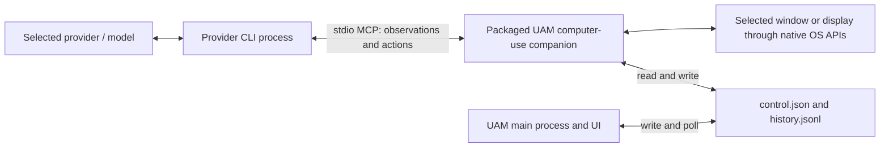

# Computer use

This document defines the computer-use architecture, routing rules, security
boundaries, platform requirements, and release-review criteria for Universal
Agent Manager (UAM). The feature applies to structured chat sessions. Raw
interactive terminal sessions remain provider-owned.

## Architecture

For the UAM backend, UAM adds one per-session `uam-computer` stdio MCP server to
the provider process at launch. The provider is the MCP client and calls the
packaged UAM computer-use companion directly.



The main UAM process is not a proxy for individual MCP calls. It selects the
configuration, persists only the backend preference, starts the provider, and
writes or polls local control and history files. Enablement and the exact target
grant are runtime-only. On startup UAM best-effort rewrites any known prior
control file to `stopped` before providers can launch; a reset failure is shown
as a warning. The companion captures the granted target,
returns a bounded PNG and accessibility labels to the provider, receives one
action at a time, and applies approved input through native OS APIs.

Multiple chats may hold separately approved targets. Observations can run in
parallel, while native input actions use a short instance-wide lock so clicks,
typing, and other input from different chats cannot overlap. In Codex sessions,
UAM enables either provider computer use or the UAM MCP server, never both.

## Backend selection

Each chat persists a preference:

- `auto` — use the packaged UAM backend. This is the portability-safe default
  for every supported structured provider, including Codex.
- `provider` — explicitly opt in to the provider-native backend. This is a
  Codex-only preview. UAM does not capability-check the installed Codex CLI.
- `uam` — always use the packaged UAM MCP companion.

The effective backend is resolved for the selected provider when its structured
process launches. Codex is currently the only provider-native candidate exposed
by UAM, but generic Codex app-server portability has not been verified across
all packaged CLI versions and runtime environments. UAM does not probe the
installed CLI for this capability. Therefore `auto` does not select it; a user
must explicitly choose the unprobed preview `provider` option.

| Structured provider | Provider-native backend available to UAM | `auto` | `provider` | `uam` |
|---|---:|---|---|---|
| Codex | Unprobed preview | UAM | Provider preview | UAM |
| Claude Code (`claude -p`) | No | UAM | Unavailable | UAM |
| Gemini CLI | No | UAM | Unavailable | UAM |
| OpenCode CLI | No | UAM | Unavailable | UAM |
| GitHub Copilot CLI | No | UAM | Unavailable | UAM |

[Anthropic's Claude Code computer-use documentation](https://code.claude.com/docs/en/computer-use)
states that the built-in server requires an interactive session and is
unavailable with the non-interactive `-p` flag. UAM's structured Claude runtime
uses `-p`, so it cannot use that controller. Claude's native capability remains
available only in an eligible interactive Claude Code session outside UAM
structured chat.

This release has no local-model computer-use engine. Local model engines are
outside the supported release scope; observations go to the provider and model
selected for the chat.

## UAM security and trust boundary

### Target restriction

The user grants one exact visible window or display. For a window, the companion
records both its OS window identifier and owning process identifier. It
revalidates the PID, target availability, and geometry before input, rejects
stale frame identifiers, and requires a new observation after a resize or
target change. A full-display grant is broader than a window grant: it can
capture the whole display and use pointer actions in any visible application on
it. Typing and hotkeys require an exact window grant so keyboard focus cannot
escape the selected target.

On macOS, exact-window pointer actions are posted to the owning process and
Accessibility presses are preferred, so they do not normally move the user's
physical cursor. A display has no owning process; its pointer actions use
system-wide HID events and visibly move the physical cursor. Use a display to
discover or open the intended target, then grant its exact window for
nonintrusive control.

For local control and history paths, the companion accepts only portable chat
identifiers containing 1–128 ASCII letters, digits, hyphens, or underscores.
It also rejects Windows reserved device names before constructing a path.

### Approval and control

The model names its intended application, window, or display in its first
`computer_observe` call. UAM resolves that live target and presents one
OS-native **Deny/Allow** decision before returning any screenshot or
accessibility data. The provider cannot answer the dialog, and Deny is the
default button so an Enter key already in flight cannot approve control.

Allow grants observation and input only for that exact target for the current
chat runtime. The same observation continues immediately after approval, and
later observations and actions do not prompt again. Pause, Stop, turning
Computer Use off, or closing the target revokes the grant. Typed content stays
redacted from local history.

UAM configures its trusted Computer Use tools to bypass redundant provider
approval prompts. OpenCode receives a two-minute MCP request budget and Codex a
five-minute per-server tool budget so the native Allow/Deny decision can remain
open without creating a provider timeout/retry loop. Other provider tools keep
their normal approval policy.

An action may return an updated screenshot and accessibility map in its result.
A bounded wait injects no input, returns no screenshot or accessibility map,
invalidates the prior frame, and requires another `computer_observe` before
more input. The target grant and UAM pause/stop controls are the hard safety
boundary for calls through the companion.

Pause and Stop are cooperative controls. The main process writes the requested
state to:

```text
<data-root>/computer-use/<chat-id>/control.json
```

The companion checks that state around observations and actions and at safe
checkpoints. Pause or Stop prevents subsequent work, but it cannot retract input
already delivered to the operating system. UAM does not claim a global Escape
key or global emergency hotkey.

The provider child inherits UAM's data-root location and can access the
per-chat control directory, so the JSON state is a cooperative stop signal, not
an authorization boundary. The one native target approval is the authorization
boundary for the UAM companion; it grants observation and input only for that
resolved target until revoked.
Disabling the feature terminates the structured provider process first; a
failure to update the cooperative control file cannot keep that process alive.

UAM also disables the known Codex built-in controller whenever the UAM backend
is selected, so those two controllers are never enabled together. This is not
a sandbox around the provider CLI. Provider/user configuration can add other
MCP servers, and normal shell tools may be able to invoke separate screenshot
or input utilities subject to provider permissions and OS policy. UAM's prompt
directs the provider to use only the selected controller, but prompt guidance is
not an enforcement boundary. Managed deployments that require controller
exclusivity must audit provider configuration and combine UAM with restrictive
provider permissions and host controls.

Provider-native computer use has a different trust boundary. Its approvals,
targeting, audit facilities, and kill switch are owned by the provider. UAM's
selected target, Pause/Stop state, and UAM action history do not apply to a
provider-native controller. Turning **Active** off always terminates that
chat's structured provider process, for either backend and even when a turn is
in progress, so the disabled process cannot retain a controller. The provider's
own in-session controls remain its responsibility. Assess the provider's
guarantees separately.

### Data sent to the provider

For the UAM backend, each observation can include:

- a PNG screenshot of the selected window or display;
- visible accessibility labels, roles, enabled state, and element geometry; and
- tool results and error details needed to continue the task.

This data passes through the active provider CLI to the selected provider and
model. “Local-first” describes UAM's application storage and absence of a UAM
cloud backend; it does not mean computer-use observations remain on the device.
Review the provider's contract, retention, region, logging, and model-training
terms before enabling the feature.

### Local history

The UAM companion appends local action metadata and results to:

```text
<data-root>/computer-use/<chat-id>/history.jsonl
```

Control-file reads are capped at 4 KiB; an unreadable, oversized, malformed, or
unknown control value fails closed as `stopped`. History reads and writes are
bounded to 512 KiB, and UAM exposes at most the most recent 50 valid entries.
Typed text is recorded only as redacted metadata, not as its contents. These
files are local diagnostics, not a centralized or tamper-evident compliance
audit. Apply the same host access controls, backup policy, retention policy, and
secure-deletion policy used for the rest of the UAM data root.

### Prompt injection and sensitive work

Treat all text shown in the controlled application as untrusted. A page,
document, message, or image can attempt to redirect the model or request data
outside the user's task. Native approval reduces risk but does not make an
unsafe instruction trustworthy.

Do not use computer use for passwords, authentication secrets, payment or
investment activity, health or legal records, privileged administration, or
other consequential operations unless exposure and execution are explicitly
intended and independently supervised. Close unrelated sensitive applications
before granting a display.

## Platform permissions and packaging

### macOS

The packaged `UAM Computer Use.app` companion needs:

- **Screen Recording** to capture the selected target; and
- **Accessibility** to send mouse and keyboard input and inspect accessible UI.

Grant these to the companion in **System Settings → Privacy & Security**, then
restart UAM and retry the observation or action. Model tool calls only preflight
these OS permissions; they never open or repeat macOS permission requests.
Gemini receives a bundled exact-tool policy for only `computer_observe` and
`computer_action`; UAM never infers trust from Gemini's model-written permission
title.
Permission denial must fail closed. If a listed switch is already on after an
app update but macOS still denies access, remove the stale entry and add the
current UAM app again before restarting. Review and test the exact release
bundle, because macOS privacy grants are tied to code identity and can change
when bundle identifiers or signing requirements change.

When the grant is an exact window, a keyboard action may raise and focus that
selected window before posting input so the keystrokes reach the granted
target. This is a visible focus change, not permission to activate a different
window; the window identifier and owning process are revalidated first.

For a distributable build:

- keep the companion nested at
  `Universal Agent Manager.app/Contents/Frameworks/UAM Computer Use.app`;
- retain a stable companion bundle identifier and executable identity;
- sign the companion and all nested code with the organization's Developer ID;
- keep the computer-use companion free of CEF JIT, unsigned-executable-memory,
  and library-validation bypass entitlements; sign any linked framework with
  the same trusted identity instead;
- sign the outer app after nested components, with the intended hardened-runtime
  entitlements;
- verify nested and outer signatures with strict code-signature validation;
- notarize and staple the final outer application; and
- test first grant, denial, later grant, relaunch, and upgrade from the previous
  signed release.

The repository's local ad-hoc signature is suitable for development only. It is
not an enterprise distribution identity.

### Windows

Windows does not use the macOS Screen Recording and Accessibility permission
pair. Capture and input run in the signed-in interactive desktop session. The
selected window must be available on the foreground desktop; UAC secure desktop,
session isolation, and higher-integrity/elevated applications can block capture
or input and must fail visibly.

For distribution:

- package the computer-use entry point with the main executable and verify its
  resolved path, including installation paths containing spaces;
- Authenticode-sign the executable and installer with the organization's
  certificate and timestamp the signatures;
- verify signatures after installation and exercise the installed, not build
  tree, executable;
- test standard-user and elevated-target behavior, UAC prompts, lock/unlock,
  Remote Desktop if supported by policy, foreground switching, and multi-monitor
  scaling, including visible owned modal dialogs as separate selectable
  targets; and
- document any endpoint-security, screen-capture, or accessibility policy that
  blocks the feature.

Notarization and stapling apply to macOS; Authenticode and installer reputation
apply to Windows.

## Known scope limits

- Computer-use backend selection applies to structured sessions.
- `auto` uses UAM for every supported provider. Codex provider-native control is
  an explicit, unprobed preview option, not a generally verified app-server
  contract.
- Claude's built-in controller is not available through UAM's `claude -p`
  structured runtime.
- Multiple chats may hold independent target grants; native input actions are
  serialized across the UAM instance.
- UAM's target, Pause/Stop, and history controls do not govern provider-native
  computer use.
- UAM does not isolate user-configured provider MCP servers or replace the
  provider's normal shell/tool sandbox.
- Disabling computer use stops the chat's structured provider process; it does
  not preserve an in-progress turn.
- Pause and Stop are cooperative and are not a global emergency interrupt.
- The UAM history file is bounded and redacted but not tamper-evident.
- On macOS, keyboard input to a window grant may visibly raise and focus that
  exact window.
- On macOS, pointer actions against a display grant move the physical cursor;
  exact-window control does not normally do so.
- Typing and hotkeys require an exact window grant; display grants are
  observation and pointer-action only.
- Windows input requires an interactive foreground desktop and cannot control
  the UAC secure desktop.
- No local model engine, Linux implementation, remote desktop service, or
  unattended service-mode controller is included.

## Employer review checklist

- [ ] Confirm `auto` resolves to UAM for every provider and verify all three
      preferences using the exact packaged CLI versions.
- [ ] Confirm separately approved chats can observe concurrently, native input
      actions cannot overlap, and UAM never enables its companion alongside the
      known Codex built-in controller.
- [ ] Audit user/global provider MCP configuration and shell permissions for
      other screenshot or input mechanisms; apply host policy if controller
      exclusivity is required.
- [ ] Treat explicit Codex `provider` mode as an unprobed preview: verify runtime support,
      approvals, stop behavior, data handling, and audit independently from UAM
      controls.
- [ ] Verify Claude structured sessions fall back to UAM and do not claim
      interactive Claude computer use.
- [ ] Review provider contracts for screenshot and accessibility-data egress,
      retention, residency, logging, and model training.
- [ ] Exercise window and full-display selection, resize, close, PID reuse,
      multi-monitor, and stale-frame rejection.
- [ ] Deny and approve standalone observations; confirm denial returns no
      screenshot or accessibility map.
- [ ] Deny and approve every UAM action type; confirm denial sends no input,
      an approved action can safely return its updated observation, and typed
      text is previewed in the native dialog but redacted from local history.
- [ ] Confirm a wait returns no observation, invalidates its prior frame, and
      requires a separately approved observation before more input.
- [ ] Pause and stop between calls and during longer work; verify the documented
      cooperative boundary and that provider shutdown ends its companion.
- [ ] Crash and restart with a stale `running` control file; confirm startup
      rewrites it to `stopped` or shows the orphan-process warning.
- [ ] Turn **Active** off for each backend, including during an active turn, and
      confirm the structured provider process always stops.
- [ ] Reject non-portable and overlength chat identifiers; exercise unreadable,
      malformed, and oversized control/history files and confirm bounded,
      fail-closed behavior.
- [ ] Test prompt-injection examples in untrusted page and document content.
- [ ] Complete the macOS Screen Recording/Accessibility grant and signed-upgrade
      matrix, including exact-window keyboard focus and least-privilege companion
      entitlements, or the Windows foreground/UAC/elevation and owned-dialog
      matrix.
- [ ] Verify installed artifact paths, code signatures, macOS notarization and
      stapling, and Windows Authenticode signatures.
- [ ] Approve host permissions, data-root access, retention, incident response,
      acceptable-use exclusions, and user-facing consent text before rollout.
